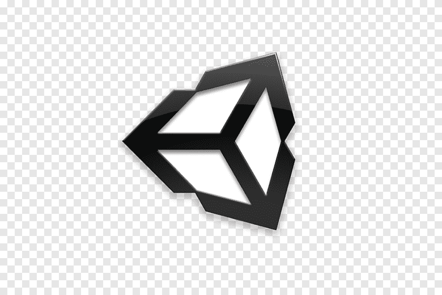
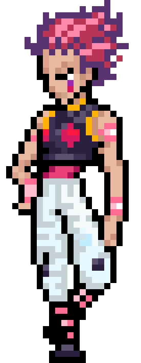

<h1 align="center">Hi!!!, I'm Francisco Carmona</h1>
<h2 align="center">A software developer in constant learning.</h2>
<h3 align="center">Languages and Tools:</h3>

  

  
  &nbsp &nbsp &nbsp &nbsp &nbsp
  

